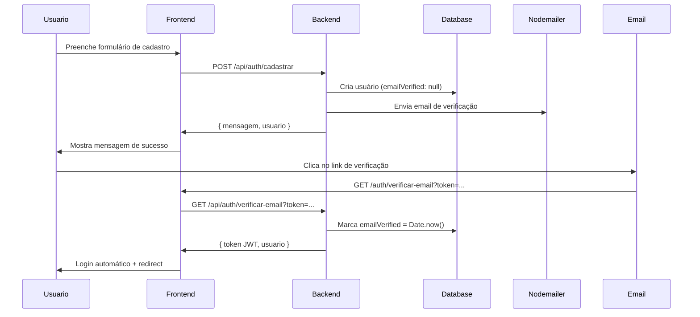

# 🔐 Autenticação VittaCash

## Arquitetura

O VittaCash usa **duas APIs separadas**:

### 1. Backend Node.js/Express (`vittacash-backend`)
- **Porta**: 3001
- **Responsável por**:
  - Autenticação tradicional (email/senha)
  - Envio de emails (Nodemailer)
  - Verificação de email
  - Login Google OAuth
  - Geração de JWT

### 2. Frontend Next.js (`vittacash`)
- **Porta**: 3000
- **Responsável por**:
  - Interface do usuário
  - Rotas do Next.js (páginas)
  - API Routes internas (se necessário)

---

## Fluxo de Cadastro Tradicional



---

## Endpoints da Autenticação

### Backend (Node.js/Express) - `localhost:3001`

| Método | Endpoint | Descrição |
|--------|----------|-----------|
| `POST` | `/api/auth/cadastrar` | Cadastro tradicional |
| `POST` | `/api/auth/login` | Login tradicional |
| `POST` | `/api/auth/login-google` | Login via Google OAuth |
| `GET` | `/api/auth/verificar-email` | Verificar email com token |
| `POST` | `/api/auth/reenviar-verificacao` | Reenviar email |

### Frontend (Next.js) - `localhost:3000`

| Rota | Descrição |
|------|-----------|
| `/auth/cadastro` | Página de cadastro |
| `/auth/login` | Página de login |
| `/auth/verificar-email` | Página de verificação |
| `/auth/reenviar-verificacao` | Página de reenvio |

---

## Variáveis de Ambiente

### Frontend (`.env.local`)
```env
# Backend API
NEXT_PUBLIC_BACKEND_URL=http://localhost:3001
```

### Backend (`.env`)
```env
# SMTP (Email)
SMTP_HOST=smtp.gmail.com
SMTP_PORT=587
SMTP_USER=seu-email@gmail.com
SMTP_PASS=sua-senha-de-app

# JWT
JWT_SECRET=seu-secret-super-seguro

# Frontend
FRONTEND_URL=http://localhost:3000

# Google OAuth
GOOGLE_CLIENT_ID=seu-client-id
GOOGLE_CLIENT_SECRET=seu-secret
```

---

## Configuração do Gmail para SMTP

1. Ative a **Verificação em 2 etapas** na sua conta Google
2. Acesse: https://myaccount.google.com/apppasswords
3. Gere uma **Senha de app** para "Mail"
4. Use essa senha no `SMTP_PASS` (não a senha normal)

---

## Testes

### 1. Testar Backend Diretamente (Swagger)
```
http://localhost:3001/api-docs
```

### 2. Testar Frontend
```bash
# Terminal 1 - Backend
cd vittacash-backend
npm run dev

# Terminal 2 - Frontend
cd vittacash
npm run dev
```

### 3. Verificar Logs
- Backend mostrará: `✅ E-mail de verificação enviado para: ...`
- Frontend mostrará: `📤 Enviando cadastro para: http://localhost:3001/api/auth/cadastrar`

---

## Problemas Comuns

### ❌ Email não chega
- Verifique se `SMTP_USER` e `SMTP_PASS` estão corretos
- Confira se é senha de app (não senha normal)
- Veja logs do backend para erros

### ❌ "Failed to fetch"
- Backend não está rodando
- URL errada no `NEXT_PUBLIC_BACKEND_URL`
- Porta 3001 bloqueada

### ❌ "E-mail já cadastrado"
- Usuário já existe no banco
- Use "Reenviar verificação" se não verificou ainda
- Ou faça login normal

---

## Debug

### Frontend
```javascript
console.log('Backend URL:', process.env.NEXT_PUBLIC_BACKEND_URL);
```

### Backend
```javascript
console.log('SMTP configurado:', !!process.env.SMTP_USER);
```

---

## Segurança

✅ Senhas com bcrypt (10 rounds)  
✅ Tokens JWT com expiração  
✅ Tokens de verificação SHA-256  
✅ Email obrigatório antes de usar  
✅ CORS configurado  
✅ Validação com Joi  

---

Desenvolvido com ❤️ por Sarah Hernandes
